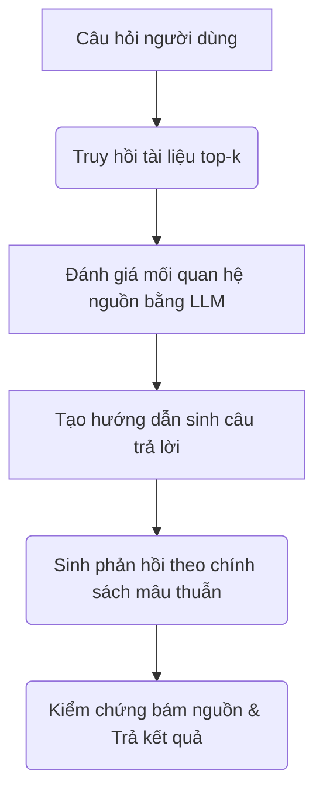

# BÁO CÁO Ý TƯỞNG & LUỒNG XỬ LÝ HỆ THỐNG DRAG (CONFLICT-AWARE RAG)

---

## 1. Ý tưởng cốt lõi (Core Idea & Motivation)

Trong các hệ thống RAG thông thường (Vanilla RAG), mô hình ngôn ngữ lớn (LLM) nhận các tài liệu truy hồi và tổng hợp câu trả lời một cách thụ động. Khi tài liệu nguồn chứa các thông tin mâu thuẫn nhau (Knowledge Conflicts), Vanilla RAG thường gặp các lỗi nghiêm trọng:
*   **Mất tính trung lập:** LLM tự ý chọn tin vào một nguồn và bỏ qua nguồn còn lại khi có sự bất đồng ý kiến (Conflicting Opinions).
*   **Sử dụng thông tin lỗi thời:** Trả lời bằng dữ liệu cũ do không nhận biết được sự thay đổi thời gian/phiên bản của các nguồn (Freshness).
*   **Lan truyền thông tin sai lệch:** Lặp lại thông tin sai từ câu hỏi của người dùng hoặc từ một nguồn kém uy tín mà không đính chính (Misinformation).
*   **Bỏ sót góc nhìn:** Chỉ đưa ra một khía cạnh của câu trả lời trong khi các nguồn bổ trợ cho nhau (Complementary Information).

**Ý tưởng cốt lõi của DRAG (Relationship-aware Answer Generation):** 
Trước khi trả lời, hệ thống phải đóng vai trò như một **"người điều phối"** đánh giá mối quan hệ giữa các nguồn thông tin được tìm thấy. Từ đó phân loại loại mâu thuẫn (nếu có) và áp dụng một **Chính sách trả lời (Answer Policy)** phù hợp để điều hướng LLM sinh câu trả lời chính xác, trung lập và an toàn.

---

## 2. Quy trình xử lý Concept trong hệ thống (High-Level Workflow)

Quy trình xử lý của DRAG gồm 2 bước chính diễn ra tuần tự sau khi người dùng gửi câu hỏi:

1.  **Bước 1 - Đánh giá mâu thuẫn (Assess Relationship):**
    Hệ thống gom câu hỏi và các tài liệu tìm thấy gửi cho một mô hình phán quyết (LLM Judge). Mô hình này sẽ phân tích các nguồn xem chúng đồng thuận, bổ sung hay mâu thuẫn với nhau ở khía cạnh nào. Đầu ra của bước này gồm:
    *   **Loại mâu thuẫn:** Thuộc 1 trong 5 nhóm của Taxonomy.
    *   **Độ tin cậy (Confidence):** Xác suất tin cậy của việc phân loại.
    *   **Lý do (Rationale):** Giải thích chi tiết tại sao lại tồn tại mâu thuẫn đó.
    *   **Chính sách trả lời (Answer Policy):** Chỉ thị cụ thể về cách mô hình sinh câu trả lời nên ứng xử với các nguồn thông tin.

2.  **Bước 2 - Sinh câu trả lời có định hướng (Guided Generation):**
    Các thông tin phân tích mâu thuẫn (gồm nhãn, lý do, chính sách trả lời) được đóng gói thành một hướng dẫn ngữ cảnh (`DRAG_CONFLICT_ASSESSMENT`) và truyền vào Prompt cho LLM sinh câu trả lời. LLM dựa vào hướng dẫn này để biết mình cần phải trung lập, ưu tiên nguồn mới, hay tổng hợp ghép nối các nguồn.

---

## 3. Phân loại mâu thuẫn & Cách xử lý cụ thể

Hệ thống phân chia các tình huống thông tin thành 5 nhóm với chính sách hành vi cụ thể:

| Loại mâu thuẫn | Ý nghĩa | Cách xử lý trong hệ thống (Answer Policy) |
| :--- | :--- | :--- |
| **Không xung đột** *(no_conflict)* | Các nguồn thông tin đồng thuận và tương đương nhau. | Trả lời trực tiếp, rõ ràng và trích dẫn đầy đủ nguồn tương ứng. |
| **Thông tin bổ sung** *(complementary)* | Các nguồn cung cấp các khía cạnh khác nhau nhưng tương thích của cùng một câu trả lời. | Ghép nối các mảnh thông tin từ các nguồn để tạo nên một câu trả lời toàn diện, đa chiều, tránh thiếu sót. |
| **Xung đột quan điểm** *(opinions)* | Các nguồn đưa ra ý kiến trái chiều hoặc kết quả nghiên cứu đối lập nhau. | Trình bày trung lập tất cả các quan điểm, chỉ rõ bên nào nói gì, tuyệt đối không đứng về một phía hoặc tự ý bác bỏ một nguồn. |
| **Thông tin lỗi thời** *(freshness)* | Thông tin mâu thuẫn do sự thay đổi của thời gian (số liệu cũ/mới, phiên bản luật cũ/mới). | Ưu tiên dữ liệu cập nhật mới nhất, chỉ rõ mốc thời gian của từng số liệu, và giải thích số liệu cũ đã bị thay thế thế nào. |
| **Thông tin sai lệch** *(misinformation)* | Câu hỏi của người dùng chứa tiền đề sai hoặc tồn tại nguồn thông tin sai rõ ràng. | Đính chính claim sai lệch dựa trên bằng chứng xác thực trong tài liệu đáng tin cậy nhất, không lặp lại thông tin sai như sự thật. |

---

## 4. Đánh giá & Điểm đánh đổi (Trade-offs)

### Ưu điểm:
*   **Định hướng chính xác:** Cải thiện đáng kể độ khớp hành vi (Behavior Alignment) của mô hình. Tránh được việc LLM trả lời thiên lệch hoặc bịa đặt.
*   **Dễ dàng tích hợp:** Kiến trúc dạng plug-and-play dạng modular cho phép dễ dàng tích hợp vào bất kỳ luồng xử lý RAG hiện có nào mà không cần sửa đổi sâu cấu trúc cốt lõi của Agent.
*   **Trải nghiệm người dùng minh bạch:** Trên giao diện, hệ thống hiển thị trực tiếp một thanh cảnh báo loại xung đột và lý do phân tích của DRAG. Người dùng hiểu rõ cấu trúc dữ liệu của nguồn tài liệu trước khi đọc câu trả lời.
*   **Hạn chế hallucination:** Việc bắt buộc mô hình phải kiểm chứng mối quan hệ nguồn giúp nâng cao tính thực tế (Faithfulness) khi sinh.

### Điểm đánh đổi cần lưu ý:
*   **Rủi ro phân loại sai (Misclassification):** Nếu mô hình phán quyết (LLM Judge) nhận diện sai nhóm mâu thuẫn (ví dụ: nhầm lẫn giữa xung đột quan điểm và thông tin bổ sung), chính sách trả lời tương ứng được áp dụng có thể dẫn đến việc LLM bỏ sót thông tin quan trọng hoặc trình bày thiếu tự nhiên.
*   **Chi phí Token:** Việc gửi toàn bộ ngữ cảnh truy hồi vào prompt phân tích mâu thuẫn làm tăng lượng token tiêu thụ đầu vào.

---

## 5. Kết quả Đánh giá Thực tế (Experimental Results)

Hệ thống đã được đánh giá thực tế trên 20 câu hỏi lịch sử từ bộ dữ liệu `data_raw.json` (quy mô 150 ngữ cảnh). Kết quả so sánh giữa Baseline RAG và DRAG RAG:

| Phương pháp | Recall@5 | MRR@5 | Hit@5 | RAGAS Avg | Faithfulness | Relevancy | Correctness | Độ trễ TB | Token TB |
| :--- | :---: | :---: | :---: | :---: | :---: | :---: | :---: | :---: | :---: |
| **Baseline RAG** | 0.900 | 0.710 | 0.900 | 0.920 | 0.900 | 0.950 | 0.900 | 4.58s | 1509.3 |
| **DRAG RAG** | 0.900 | 0.710 | 0.900 | 0.890 | 0.855 | 0.950 | 0.865 | 5.59s | 3172.7 |

*   **Nhận xét:** Khi không có mâu thuẫn kiến thức (`data_raw.json` là dữ liệu chuẩn, không xung đột), DRAG đạt độ chính xác truy hồi tương đương Baseline RAG. DRAG tốn nhiều token hơn (~2x) và tăng độ trễ (~1s mỗi câu) do bước phân tích mâu thuẫn trước sinh. Tuy nhiên ở các câu hỏi khó (như QID `0001-0012-0002`), chính sách phân tích nguồn của DRAG giúp khắc phục lỗi sai mốc thời gian của Baseline (RAGAS **0.920** vs **0.400**).
