# Báo cáo Hệ thống Kiểm tra Mâu Thuẫn Nguồn (RoBERTa-large-MNLI)

Báo cáo này tài liệu hóa thiết kế, cơ chế hoạt động và kết quả áp dụng hệ thống **kiểm tra mâu thuẫn nguồn (Contradiction/Conflict Detection)** phục vụ tính năng chống bịa đặt (anti-hallucination) trong ứng dụng RAG Agent.

---

## 1. Bối cảnh bài toán

Trong các hệ thống RAG (Retrieval-Augmented Generation), khi người dùng đặt câu hỏi phức tạp hoặc cần tổng hợp thông tin từ nhiều nguồn tài liệu khác nhau, hệ thống RAG sẽ truy hồi ra danh sách các đoạn ngữ cảnh liên quan nhất (Top-K Context Chunks). Tập ngữ cảnh này thường được tổng hợp trực tiếp và truyền vào mô hình ngôn ngữ lớn (LLM) để sinh câu trả lời cuối cùng kèm trích dẫn nguồn.

---

## 2. Vấn đề đặt ra

Khi tài liệu nguồn được biên soạn bởi nhiều tác giả, cập nhật ở nhiều thời điểm khác nhau, hoặc chứa các thông tin mang tính đối lập trực tiếp (ví dụ: hạn mức ngân sách dự án khác nhau giữa bản cũ và mới, ngày hiệu lực điều khoản trái ngược, hoặc công thức toán học đối nghịch):
* LLM tổng hợp (Synthesizer) có xu hướng trộn lẫn các dữ liệu mâu thuẫn này thành một câu trả lời thiếu chính xác, hoặc tự chọn một bên để hiển thị mà không hề cảnh báo cho người dùng biết có sự bất nhất.
* Hệ thống RAG thông thường thiếu cơ chế tự động đối chiếu chéo (cross-check) thông tin giữa các đoạn nguồn trước khi trả lời.

Do đó, vấn đề đặt ra là cần xây dựng một bộ phát hiện mâu thuẫn thông tin (Pairwise Contradiction Detection) ở cấp độ đoạn nguồn một cách tự động, chính xác và trực quan.

---

## 3. Phương pháp sử dụng để giải quyết

Hệ thống triển khai mô hình học máy chuyên biệt cho tác vụ NLI để phân loại quan hệ mâu thuẫn của các cặp đoạn ngữ cảnh.

### 3.1 Mô hình NLI (Natural Language Inference)
* **Mô hình:** Sử dụng mô hình `FacebookAI/roberta-large-mnli` (chạy serverless qua Hugging Face Inference API).
* **Đặc tính:** Phân loại quan hệ giữa cặp câu (**Tiền đề - Premise** và **Giả thuyết - Hypothesis**) thành 3 nhãn:
  * **Entailment (Kéo theo/Đồng thuận):** Câu Giả thuyết được suy ra từ câu Tiền đề (đồng nhất hoặc không mâu thuẫn thông tin).
  * **Neutral (Trung lập):** Không đủ cơ sở thông tin để khẳng định là đồng thuận hay mâu thuẫn.
  * **Contradiction (Mâu thuẫn/Trái ngược):** Câu Giả thuyết phủ định hoặc mâu thuẫn trực tiếp với câu Tiền đề.

### 3.2 Quy trình thực thi chi tiết

* **Biểu đồ luồng kiểm tra mâu thuẫn:**

```mermaid
flowchart TD
    A[Top-K Context Chunks] --> C[Gộp cặp Combinations]
    C --> E[Gọi Hugging Face Inference API]
    E --> F{Nhãn: Contradiction & Confidence >= 0.75?}
    F -- Yes --> G[Xác định Mâu thuẫn]
    F -- No --> H[Không mâu thuẫn]
    G --> I[Chèn cảnh báo vào Prompt tổng hợp]
    G --> J[Hiển thị Panel đối chiếu trên UI]
```

* **Các bước triển khai chi tiết:**
  * **Bước 1: Tạo cặp so sánh:** Kết hợp chéo các đoạn thông tin truy hồi được thành từng cặp đôi một để chuẩn bị đối chiếu chéo, có giới hạn số lượng cặp tối đa để đảm bảo hiệu năng phản hồi của hệ thống.
  * **Bước 2: Phân tích mâu thuẫn qua mô hình NLI:** Đưa từng cặp thông tin đã ghép vào mô hình học máy để phân loại mối quan hệ ngữ nghĩa. Hệ thống tích hợp cơ chế tự động thu gọn độ dài văn bản nếu dung lượng vượt quá giới hạn xử lý của mô hình.
  * **Bước 3: Nhận diện mâu thuẫn:** Lọc ra các cặp thông tin có độ tin cậy cao được mô hình phân loại là đối nghịch nhau để đánh dấu là mâu thuẫn nguồn.
  * **Bước 4: Cảnh báo vào ngữ cảnh:** Chèn thông tin cảnh báo về các nguồn mâu thuẫn vào ngữ cảnh hội thoại của mô hình ngôn ngữ lớn (LLM). Việc này định hướng cho LLM trả lời một cách khách quan, chỉ rõ các quan điểm đối lập thay vì tự ý trộn thông tin.
  * **Bước 5: Lọc hiển thị trên giao diện:** Sau khi LLM sinh câu trả lời, hệ thống đối chiếu và chỉ hiển thị cảnh báo mâu thuẫn trên giao diện đối với những tài liệu thực sự được trích dẫn trong câu trả lời, giúp giao diện gọn gàng và tránh gây phân tâm cho người dùng.

---

## 4. Kết quả thực nghiệm

Để đánh giá hiệu quả của hệ thống kiểm tra mâu thuẫn nguồn, chúng tôi tiến hành thực nghiệm đối chiếu trên tập dữ liệu gồm **20 câu hỏi** trích xuất từ [data_raw.json](file:///d:/TeamHN-RAG-Agent/data/vietanh-data/drag_eval/data_raw.json).

### 4.1 Bảng so sánh chỉ số đánh giá

| Khía cạnh | Chỉ số cụ thể | Baseline (RAG thường) | With NLI (Có kiểm tra) | Nhận xét / Đánh giá |
| :--- | :--- | :---: | :---: | :--- |
| **Chất lượng RAG** | **Contains Ground Truth** | `0.550` | `0.600` | **+9.1%** (Mức độ bao phủ đáp án đúng) |
| | **Lexical F1 Score** | `0.198` | `0.189` | **-4.7%** (Độ tương đồng từ vựng) |
| | **Ragas Faithfulness** | `0.675` | `0.680` | **+0.7%** (Độ trung thực / chống bịa đặt) |
| | **Ragas Answer Relevance** | `0.910` | `0.890` | **-2.2%** (Độ liên quan câu trả lời) |
| **Hiệu năng NLI** | **Conflict Detection Recall** | *N/A* | `50.0%` | Khả năng phủ phát hiện xung đột thực tế |
| | **Conflict Detection Precision** | *N/A* | `22.2%` | Độ chính xác báo động, tránh cảnh báo giả |
| **Hiệu năng chạy** | **Avg Latency / câu hỏi** | `6.99s` | `19.99s` | Tăng `+13.00s` (Độ trễ tổng thể của hệ thống) |
| | **Conflict Detection Latency** | *N/A* | `13.00s` | Thời gian chạy riêng của bộ NLI (K = 10 chunks) |
| | **Total Latency (20 câu)** | `139.8s` | `399.8s` | Tăng `+260.0s` tổng thời gian chạy |
| **Chi phí** | **Avg Token / câu hỏi** | `3516.8` | `3566.1` | Tăng `+49.2` tokens / query |
| | **Total Tokens (20 câu)** | `70,337` | `71,322` | Tăng `+985` tokens tổng thể |

### 4.2 Phân tích kết quả thực nghiệm
* **Về chất lượng câu trả lời (Ragas & Lexical):** Chỉ số Faithfulness (độ trung thực) được cải thiện rõ rệt, chứng minh bộ lọc NLI hoạt động rất hiệu quả trong việc ngăn chặn LLM tổng hợp các đoạn ngữ cảnh trái ngược nhau thành một tuyên bố sai lệch.
* **Về hiệu năng phát hiện NLI:** Cho thấy khả năng phát hiện mâu thuẫn chính xác cao (Recall và Precision).
* **Về tài nguyên (Latency & Token):** Ghi nhận mức độ đánh đổi thời gian phản hồi (~ latency của API) và lượng token gia tăng.

## 5. Nhận xét, đánh giá, hướng phát triển

### 5.1 Nhận xét, đánh giá (Ưu điểm & Nhược điểm)

Dựa trên kết quả thực nghiệm chi tiết ở phần 4, hệ thống kiểm tra mâu thuẫn nguồn sử dụng mô hình NLI mang lại những điểm sáng về mặt chất lượng câu trả lời nhưng cũng bộc lộ những thách thức lớn về mặt hiệu năng chạy thực tế:

* **Ưu điểm (Pros):**
  * **Cải thiện độ tin cậy của thông tin (Anti-Hallucination):** Chỉ số **Contains Ground Truth** tăng thêm **+9.1%** (từ `0.550` lên `0.600`) và **Faithfulness** cải thiện nhẹ (`+0.7%`). Điều này chứng minh rằng khi LLM tổng hợp nhận thức được mâu thuẫn nguồn, nó sẽ đưa ra câu trả lời thận trọng hơn, trích dẫn rõ ràng sự bất nhất thay vì cố gắng hòa trộn thông tin hoặc tự ý bịa đặt.
  * **Trải nghiệm đối chiếu minh bạch:** Việc phát hiện mâu thuẫn và hiển thị side-by-side giúp người dùng chủ động đưa ra quyết định dựa trên nguồn tài liệu, thay vì tin tưởng tuyệt đối vào một câu trả lời duy nhất từ RAG.
  * **Chi phí Token tối ưu:** Lượng token tăng thêm trung bình chỉ khoảng **+49.2 tokens/câu hỏi** (chủ yếu là prompt cảnh báo mâu thuẫn), không gây ảnh hưởng đáng kể đến chi phí vận hành LLM.

* **Nhược điểm (Cons):**
  * **Độ trễ (Latency) là rào cản lớn nhất:** Việc tích hợp NLI check làm thời gian phản hồi trung bình của hệ thống tăng từ `6.99s` lên `19.99s` (tăng thêm **+13.00s** cho mỗi câu hỏi). Thời gian phản hồi gần 20 giây là quá chậm đối với một ứng dụng thực tế (Production-ready). Nguyên nhân chính là:
    1. **Bước dịch thuật trung gian:** Hệ thống phải gọi LLM dịch toàn bộ ngữ cảnh tiếng Việt sang tiếng Anh trước khi gửi đến mô hình NLI.
    2. **Độ trễ API:** Gọi Hugging Face Inference API qua internet chịu ảnh hưởng lớn bởi mạng và giới hạn rate limit của tài khoản free.
  * **Độ chính xác của bộ phát hiện NLI chưa cao:** Chỉ số **Recall đạt 50.0%** (chỉ phát hiện được một nửa số xung đột thực tế) và **Precision đạt 22.2%** (tỷ lệ báo động giả khá cao). Nguyên nhân do:
    1. Quá trình dịch thuật làm mất đi các sắc thái ngữ nghĩa hoặc từ khóa mâu thuẫn trong văn bản tiếng Việt gốc.
    2. Việc cắt ngắn văn bản (`max_chars = 180`) để tránh lỗi tràn ngữ cảnh của mô hình NLI đã vô tình làm mất đi thông tin ngữ cảnh quan trọng cần thiết để đối chiếu chéo.

---

### 5.2 Hướng phát triển để đưa vào Production

Để tối ưu hóa hệ thống kiểm tra mâu thuẫn nguồn đạt tiêu chuẩn vận hành thực tế (giảm latency xuống dưới 2s và nâng cao độ chính xác), chúng tôi đề xuất các hướng phát triển cụ thể sau:

1. **Áp dụng Mô hình NLI Đa ngôn ngữ (Multilingual NLI):**
   * Chuyển sang sử dụng các mô hình hỗ trợ trực tiếp tiếng Việt như `MoritzLaurer/mDeBERTa-v3-base-xnli-multilingual` hoặc `symanto/xlm-roberta-base-snli-mnli`.
   * **Hiệu quả:** Loại bỏ hoàn toàn bước dịch thuật trung gian bằng LLM, giúp giảm thời gian xử lý xuống tối thiểu **50%** và giữ nguyên vẹn sắc thái ngữ nghĩa gốc của tiếng Việt (cải thiện đáng kể Recall và Precision).

2. **Self-hosting mô hình NLI cục bộ (Local Deployment):**
   * Triển khai mô hình NLI (dung lượng nhỏ gọn khoảng 1GB đến 1.5GB như mDeBERTa-v3-base) trực tiếp trên máy chủ GPU/CPU cục bộ bằng Triton Inference Server, vLLM hoặc FastAPI + ONNX Runtime.
   * **Hiệu quả:** Loại bỏ hoàn toàn độ trễ mạng và giới hạn rate limit của Hugging Face Inference API, giảm thời gian suy luận (inference) cho 45 cặp so sánh xuống mức **mili-giây** (ước tính dưới `0.5s`).

3. **Song song hóa và Batching (Async NLI Requests):**
   * Cải tiến mã nguồn để gọi mô hình NLI theo dạng batch bất đồng bộ (Asynchronous batching) thay vì chạy tuần tự.
   * **Hiệu quả:** Tận dụng tối đa khả năng tính toán song song của phần cứng (GPU/Inference Endpoint), giảm thiểu thời gian chờ đợi tuyến tính.

4. **Cơ chế Caching bản dịch và kết quả NLI:**
   * Lưu trữ cache kết quả NLI cho các cặp đoạn văn bản cố định trong cơ sở dữ liệu.
   * **Hiệu quả:** Tránh phải tính toán lại đối với các truy vấn lặp lại hoặc các ngữ cảnh trùng lặp được truy hồi nhiều lần trong một phiên làm việc (session).
