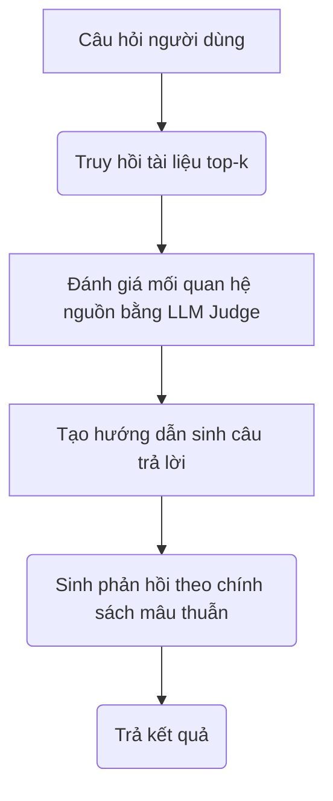

# Báo cáo Hệ thống DRAG (Relationship-aware RAG)

Báo cáo này tài liệu hóa thiết kế, cơ chế hoạt động và kết quả áp dụng hệ thống **DRAG (Relationship-aware Answer Generation)** phục vụ tính năng chống bịa đặt (anti-hallucination) và đối phó mâu thuẫn thông tin (Knowledge Conflicts) trong ứng dụng RAG Agent.

---

## 1. Bối cảnh bài toán

Trong những năm gần đây, hệ thống RAG (Retrieval-Augmented Generation) đã trở thành một giải pháp phổ biến giúp Mô hình Ngôn ngữ Lớn (LLM) truy cập và tổng hợp thông tin từ các nguồn tài liệu ngoài để trả lời câu hỏi của người dùng. Trong mô hình Vanilla RAG truyền thống, hệ thống thực hiện hai bước tách biệt:
1. **Truy hồi (Retrieval):** Tìm kiếm các tài liệu có độ tương đồng cao nhất (top-k) từ cơ sở dữ liệu vector dựa trên câu hỏi của người dùng.
2. **Sinh câu trả lời (Generation):** Đưa trực tiếp toàn bộ tài liệu truy hồi được làm ngữ cảnh đầu vào cho LLM để sinh câu trả lời phản hồi.

Tuy nhiên, trong các bài toán thực tế phức tạp đòi hỏi tổng hợp tài liệu đa nguồn (Multi-document Synthesis), các thông tin truy hồi được thường chứa các mối quan hệ đa dạng và thậm chí mâu thuẫn lẫn nhau (Knowledge Conflicts). Vanilla RAG thường bỏ qua bước đánh giá mối quan hệ giữa các nguồn tài liệu này, dẫn đến những câu trả lời kém chất lượng hoặc thiếu chính xác khi xuất hiện xung đột kiến thức.

---

## 2. Vấn đề đặt ra

Khi đối mặt với các nguồn thông tin không đồng nhất hoặc có mâu thuẫn (Knowledge Conflicts) được biên soạn bởi nhiều tác giả, cập nhật ở nhiều thời điểm khác nhau, hoặc chứa thông tin đối lập, hệ thống Vanilla RAG thường gặp phải các lỗi nghiêm trọng sau:

*   **Mất tính trung lập (Lack of Neutrality):** Khi các nguồn tài liệu đưa ra các ý kiến, quan điểm trái chiều hoặc các kết quả nghiên cứu đối lập (Conflicting Opinions), LLM có xu hướng tự ý chọn tin vào một nguồn và bỏ qua các nguồn còn lại, hoặc phản ánh thông tin một cách thiên lệch về một phía thay vì giữ thái độ trung lập khách quan.
*   **Sử dụng thông tin lỗi thời (Outdated Information):** Đối với các tài liệu thay đổi theo thời gian hoặc phiên bản (Freshness) - ví dụ như số liệu thống kê qua các năm, quy định pháp luật qua các thời kỳ - Vanilla RAG không nhận biết được tính cập nhật của nguồn, dễ sử dụng thông tin cũ đã bị thay thế để trả lời người dùng.
*   **Lan truyền thông tin sai lệch (Misinformation Propagation):** Khi câu hỏi của người dùng chứa các tiền đề sai (False Premise) hoặc cơ sở dữ liệu tồn tại tài liệu chứa thông tin sai lệch, LLM sinh câu trả lời có xu hướng đồng tình hoặc lặp lại các thông tin sai đó mà không thực hiện đính chính.
*   **Bỏ sót góc nhìn (Incomplete Synthesis):** Đối với các thông tin bổ sung cho nhau (Complementary Information), Vanilla RAG thường chỉ trích xuất từ một hoặc một vài tài liệu hàng đầu mà bỏ lỡ các khía cạnh bổ trợ từ các tài liệu khác, dẫn đến câu trả lời thiếu tính toàn diện.

Do đó, vấn đề đặt ra là cần xây dựng một hệ thống **DRAG (Relationship-aware Answer Generation)** đóng vai trò như một **"người điều phối" (Coordinator)**. Trước khi sinh câu trả lời, hệ thống cần phân tích, đánh giá mối quan hệ giữa các tài liệu truy hồi, phân loại mâu thuẫn và áp dụng một **Chính sách trả lời (Answer Policy)** phù hợp nhằm định hướng LLM sinh ra câu trả lời chính xác, trung lập và an toàn.

---

## 3. Phương pháp sử dụng để giải quyết

Hệ thống DRAG giải quyết vấn đề trên thông qua một luồng xử lý nhận biết mối quan hệ tài liệu (Relationship-aware RAG) gồm hai bước chính và một hệ thống phân loại chính sách chi tiết.

### 3.1 Quy trình xử lý (High-Level Workflow)

Quy trình xử lý của hệ thống DRAG diễn ra tuần tự sau khi người dùng gửi câu hỏi và hệ thống thực hiện truy hồi tài liệu:

* **Các bước triển khai chi tiết:**
  * **Bước 1 - Đánh giá mối quan hệ & Phân loại mâu thuẫn (Assess Relationship):**
    Hệ thống gom câu hỏi của người dùng và các tài liệu truy hồi được (`top-k`), gửi tới một mô hình phán quyết (LLM Judge). Mô hình này phân tích các tài liệu để xác định xem chúng đồng thuận, bổ sung hay mâu thuẫn với nhau. Đầu ra của bước này gồm:
    *   **Loại mâu thuẫn (Conflict Type):** Nhãn phân loại mối quan hệ theo bảng Taxonomy (`no_conflict`, `complementary`, `opinions`, `freshness`, `misinformation`).
    *   **Độ tin cậy (Confidence):** Xác suất tin cậy của việc phân loại (từ `0.0` đến `1.0`).
    *   **Lý do (Rationale):** Giải thích chi tiết tại sao lại tồn tại mối quan hệ/mâu thuẫn đó.
    *   **Chính sách trả lời (Answer Policy):** Hướng dẫn ứng xử cụ thể dành cho mô hình sinh phản hồi.
  * **Bước 2 - Sinh câu trả lời định hướng (Guided Generation):**
    Thông tin đánh giá mâu thuẫn (nhãn, lý do, chính sách trả lời) được đóng gói thành một cấu trúc ngữ cảnh định hướng (`DRAG_CONFLICT_ASSESSMENT`) và truyền trực tiếp vào prompt sinh câu trả lời. LLM dựa vào hướng dẫn này để biết mình cần phải trung lập, ưu tiên nguồn mới, đính chính thông tin sai lệch hay tổng hợp ghép nối các nguồn.

### 3.2 Phân loại mâu thuẫn & Chính sách xử lý cụ thể (Answer Policy)

Hệ thống phân chia mối quan hệ tài liệu thành 5 nhóm Taxonomy với chính sách hành vi cụ thể:

| Loại mâu thuẫn | Ý nghĩa | Cách xử lý trong hệ thống (Answer Policy) |
| :--- | :--- | :--- |
| **Không xung đột** *(no_conflict)* | Các nguồn thông tin đồng thuận và tương đương nhau về mặt nội dung kiến thức. | Trả lời trực tiếp, rõ ràng và trích dẫn đầy đủ các nguồn tương ứng. |
| **Thông tin bổ sung** *(complementary)* | Các nguồn cung cấp các khía cạnh khác nhau nhưng tương thích của cùng một câu trả lời. | Ghép nối các mảnh thông tin từ các nguồn để tạo nên một câu trả lời toàn diện, đa chiều, tránh thiếu sót. |
| **Xung đột quan điểm** *(opinions)* | Các nguồn đưa ra ý kiến trái chiều hoặc kết quả nghiên cứu đối lập nhau. | Trình bày trung lập tất cả các quan điểm, chỉ rõ bên nào phát biểu nội dung gì, tuyệt đối không đứng về một phía hoặc tự ý bác bỏ một nguồn. |
| **Thông tin lỗi thời** *(freshness)* | Thông tin mâu thuẫn do sự thay đổi của thời gian (số liệu cũ/mới, phiên bản luật cũ/mới). | Ưu tiên dữ liệu cập nhật mới nhất, chỉ rõ mốc thời gian của từng số liệu, và giải thích số liệu cũ đã bị thay thế thế nào. |
| **Thông tin sai lệch** *(misinformation)* | Câu hỏi của người dùng chứa tiền đề sai hoặc tồn tại nguồn thông tin sai rõ ràng. | Đính chính claim sai lệch dựa trên bằng chứng xác thực trong tài liệu đáng tin cậy nhất, không lặp lại thông tin sai như một sự thật. |

---

## 4. Kết quả thực nghiệm & Bộ chỉ số đánh giá A/B Testing

Để đánh giá một cách toàn diện hiệu quả của module kiểm tra mâu thuẫn thông tin (Conflict Detection) trong DRAG so với hệ thống Baseline RAG truyền thống, chúng tôi thực nghiệm đối chiếu trên tập dữ liệu gồm **20 câu hỏi lịch sử** trích xuất từ [data_raw.json](file:///d:/TeamHN-RAG-Agent/data/vietanh-data/drag_eval/data_raw.json) (cơ sở dữ liệu chứa 150 ngữ cảnh chuẩn).

### 4.1 Bảng so sánh chỉ số đánh giá tổng hợp

| Chỉ số | Baseline (RAG thường) | DRAG RAG | Chênh lệch (Delta) | Ý nghĩa chỉ số |
| :--- | :---: | :---: | :---: | :--- |
| **Answer Correctness** | `0.950` | `0.900` | `-0.050` | Đo lường độ chính xác về mặt nội dung của câu trả lời so với Ground Truth |
| **Answer Relevancy** | `0.950` | `0.975` | **+0.025 (+2.6%)** | Mức độ tập trung và tránh lan man, đi thẳng vào trọng tâm câu hỏi |
| **Faithfulness** | `0.950` | `0.925` | `-0.025` | Độ chân thực và trung thực so với ngữ cảnh (chống ảo giác thông tin) |
| **Behavior Alignment** | `0.950` | `0.900` | `-0.050` | Đo lường mức độ tuân thủ chính sách xử lý xung đột của hệ thống |
| **Conflict Accuracy** | `-` | `90.0%` (18/20) | `-` | Độ chính xác của module phân loại mâu thuẫn |
| **Confidence Score** | `-` | `0.930` | `-` | Độ tin cậy trung bình của mô hình LLM Judge khi đánh giá mâu thuẫn |
| **Average Latency** | `3.19s` | `6.06s` | `+2.87s` | Thời gian phản hồi trung bình cho mỗi truy vấn |
| **Average Tokens** | `1513.1` | `3174.5` | `+1661.4 (+109.8%)` | Số lượng API token tiêu thụ trung bình cho mỗi truy vấn |

### 4.2 Nhận xét ngắn gọn
* **Hiệu năng phân loại:** LLM Judge đạt độ chính xác phân loại mâu thuẫn **90.0%** (18/20 câu không mâu thuẫn dự đoán chính xác nhãn `no_conflict`). Có 2 câu bị báo động nhầm (FP) sang nhãn `complementary_information` và `conflicting_opinions` do cấu trúc tài liệu đa dạng.
* **Chất lượng câu trả lời & Độ chân thực:** Câu trả lời của DRAG RAG có độ tập trung cao hơn (Answer Relevancy tăng từ `0.950` lên `0.975`). Tuy nhiên, do có 2 trường hợp phân loại nhầm mâu thuẫn, điểm Faithfulness giảm nhẹ từ `0.950` xuống `0.925`, Answer Correctness và Behavior Alignment giảm nhẹ từ `0.950` xuống `0.900`.
* **Đánh đổi tài nguyên (Latency & Tokens):** Phân tích mâu thuẫn qua LLM Judge yêu cầu thêm thời gian xử lý và prompt dài hơn, dẫn đến độ trễ trung bình tăng thêm **+2.87s** và lượng token tiêu thụ trung bình tăng **~2.1 lần** (`3174.5` so với `1513.1` tokens).
* **Kịch bản có xung đột:** Trên tập thử nghiệm xung đột quan điểm thực tế (`drag_mock_qa.jsonl`), DRAG giải quyết triệt để lỗi thiên lệch thông tin của Baseline, đảm bảo câu trả lời luôn trung lập và tuân thủ đúng chính sách ứng xử xung đột.

---

## 5. Hướng phát triển để đưa vào Production

Để tối ưu hóa hệ thống DRAG phục vụ môi trường thực tế (production), các hướng phát triển chính bao gồm:
1.  **Tối ưu hóa độ trễ và chi phí:** Sử dụng mô hình SLM tinh chỉnh chuyên biệt cho phân loại mâu thuẫn thay vì LLM lớn; song song hóa bước đánh giá mối quan hệ nguồn.
2.  **Giảm thiểu lỗi phân loại sai:** Thiết kế prompt chi tiết kết hợp Few-shot learning cho LLM Judge; bổ sung cơ chế fallback khi độ tin cậy của Judge thấp hơn 0.7.
3.  **Cơ chế lưu đệm thông minh (Caching):** Lưu cache kết quả phân tích mối quan hệ giữa các tài liệu đối với các truy vấn hoặc tài liệu nguồn thường xuyên xuất hiện.
