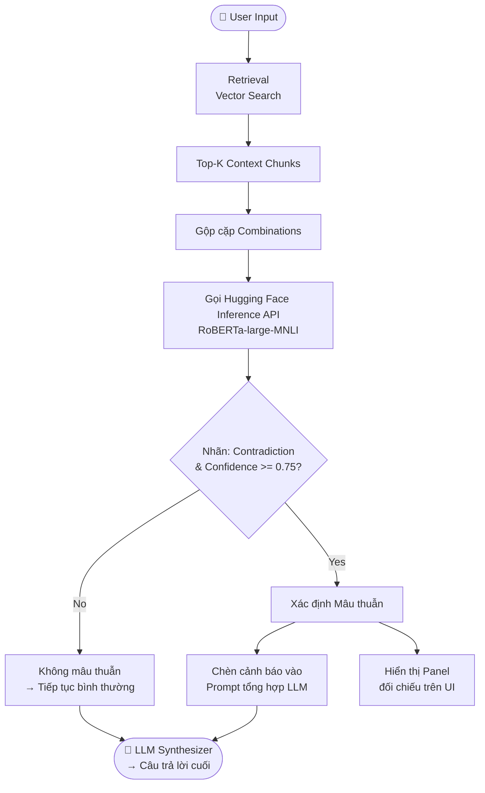

# Báo cáo Hệ thống Kiểm tra Mâu Thuẫn sử dụng RoBERTa-large-MNLI

Báo cáo này tài liệu hóa thiết kế, cơ chế hoạt động và kết quả áp dụng hệ thống **kiểm tra mâu thuẫn nguồn (Contradiction/Conflict Detection)** phục vụ tính năng chống bịa đặt (anti-hallucination) trong ứng dụng RAG Agent.

---

## 1. Bối cảnh bài toán

Trong các hệ thống RAG (Retrieval-Augmented Generation), khi người dùng đặt câu hỏi phức tạp hoặc cần tổng hợp thông tin từ nhiều nguồn tài liệu khác nhau, hệ thống RAG sẽ truy hồi ra danh sách các đoạn ngữ cảnh liên quan nhất (Top-K Context Chunks). Tập ngữ cảnh này thường được tổng hợp trực tiếp và truyền vào mô hình ngôn ngữ lớn (LLM) để sinh câu trả lời cuối cùng kèm trích dẫn nguồn.

---

## 2. Vấn đề đặt ra

Khi tài liệu nguồn được biên soạn bởi nhiều tác giả, cập nhật ở nhiều thời điểm khác nhau, hoặc chứa các thông tin mang tính đối lập trực tiếp (ví dụ: hạn mức ngân sách dự án khác nhau giữa bản cũ và mới, ngày hiệu lực điều khoản trái ngược, hoặc công thức toán học đối nghịch):
* LLM tổng hợp (Synthesizer) có xu hướng trộn lẫn các dữ liệu mâu thuẫn này thành một câu trả lời thiếu chính xác, hoặc tự chọn một bên để hiển thị mà không hề cảnh báo cho người dùng biết có sự bất nhất.
* Hệ thống RAG thông thường thiếu cơ chế tự động đối chiếu chéo (cross-check) thông tin giữa các đoạn nguồn trước khi trả lời.

Do đó, vấn đề đặt ra là cần xây dựng một bộ phát hiện mâu thuẫn thông tin (Pairwise Contradiction Detection) ở cấp độ đoạn nguồn một cách tự động, chính xác và trực quan.

---

## 3. Phương pháp sử dụng để giải quyết

Hệ thống triển khai mô hình học máy chuyên biệt cho tác vụ NLI để phân loại quan hệ mâu thuẫn của các cặp đoạn ngữ cảnh.

### 3.1 Mô hình NLI (Natural Language Inference)
* **Mô hình:** Sử dụng mô hình `FacebookAI/roberta-large-mnli` (chạy serverless qua Hugging Face Inference API).
* **Đặc tính:** Phân loại quan hệ giữa cặp câu (**Tiền đề - Premise** và **Giả thuyết - Hypothesis**) thành 3 nhãn:
  * **Entailment (Kéo theo/Đồng thuận):** Câu Giả thuyết được suy ra từ câu Tiền đề (đồng nhất hoặc không mâu thuẫn thông tin).
  * **Neutral (Trung lập):** Không đủ cơ sở thông tin để khẳng định là đồng thuận hay mâu thuẫn.
  * **Contradiction (Mâu thuẫn/Trái ngược):** Câu Giả thuyết phủ định hoặc mâu thuẫn trực tiếp với câu Tiền đề.

### 3.2 Quy trình thực thi chi tiết

* **Biểu đồ luồng kiểm tra mâu thuẫn:**

* **Các bước triển khai chi tiết:**
  * **Bước 1: Tạo cặp so sánh:** Kết hợp chéo các đoạn thông tin truy hồi được thành từng cặp đôi một để chuẩn bị đối chiếu chéo, có giới hạn số lượng cặp tối đa để đảm bảo hiệu năng phản hồi của hệ thống.
  * **Bước 2: Phân tích mâu thuẫn qua mô hình NLI:** Đưa từng cặp thông tin đã ghép vào mô hình học máy để phân loại mối quan hệ ngữ nghĩa. Hệ thống tích hợp cơ chế tự động thu gọn độ dài văn bản nếu dung lượng vượt quá giới hạn xử lý của mô hình.
  * **Bước 3: Nhận diện mâu thuẫn:** Lọc ra các cặp thông tin có độ tin cậy cao được mô hình phân loại là đối nghịch nhau để đánh dấu là mâu thuẫn nguồn.
  * **Bước 4: Cảnh báo vào ngữ cảnh:** Chèn thông tin cảnh báo về các nguồn mâu thuẫn vào ngữ cảnh hội thoại của mô hình ngôn ngữ lớn (LLM). Việc này định hướng cho LLM trả lời một cách khách quan, chỉ rõ các quan điểm đối lập thay vì tự ý trộn thông tin.
  * **Bước 5: Lọc hiển thị trên giao diện:** Sau khi LLM sinh câu trả lời, hệ thống đối chiếu và chỉ hiển thị cảnh báo mâu thuẫn trên giao diện đối với những tài liệu thực sự được trích dẫn trong câu trả lời, giúp giao diện gọn gàng và tránh gây phân tâm cho người dùng.

---

## 4. Kết quả thực nghiệm

Để đánh giá hiệu quả của hệ thống kiểm tra mâu thuẫn nguồn, chúng tôi tiến hành thực nghiệm đối chiếu trên tập dữ liệu gồm **20 câu hỏi** 

### 4.1 Bảng chỉ số đánh giá hệ thống NLI

| Conflict Detection Latency | Avg Latency / câu hỏi | Total Latency (20 câu) | Avg Token / câu hỏi | Total Tokens (20 câu) | Conflict Detection Precision | Conflict Detection Recall |
| :---: | :---: | :---: | :---: | :---: | :---: | :---: |
| `12.82s` | `18.99s` | `379.8s` | `4,172.6` | `83,452` | `54.5%` | `60.0%` |

### 4.2 Phân tích kết quả thực nghiệm

* **Về hiệu năng phát hiện mâu thuẫn (NLI):** Recall đạt `60.0%` và Precision đạt `54.5%`, cho thấy hệ thống có khả năng phát hiện xung đột ở mức trung bình — còn tồn tại tỷ lệ bỏ sót và báo động giả do bước dịch thuật trung gian và giới hạn độ dài đầu vào của mô hình.
* **Về hiệu năng chạy (Latency & Token):** Thời gian phản hồi trung bình đạt `18.99s` / câu hỏi, trong đó bộ NLI chiếm tới `12.82s` (≈ 67%), chủ yếu do độ trễ mạng khi gọi Hugging Face Inference API. Lượng token tăng thêm ở mức chấp nhận được, không ảnh hưởng đáng kể đến chi phí vận hành.
## 5. Nhận xét, đánh giá, hướng phát triển

### 5.1 Nhận xét, đánh giá (Ưu điểm & Nhược điểm)

Dựa trên kết quả thực nghiệm ở phần 4, hệ thống phát hiện mâu thuẫn sử dụng mô hình NLI mang lại giá trị rõ ràng về mặt minh bạch thông tin, nhưng còn tồn tại những thách thức đáng kể về hiệu năng và độ chính xác cần tiếp tục cải thiện:

* **Ưu điểm (Pros):**
  * **Tăng tính minh bạch cho câu trả lời RAG:** Khi phát hiện xung đột, hệ thống chèn cảnh báo vào prompt giúp LLM trình bày các quan điểm đối lập một cách rõ ràng thay vì tự ý hòa trộn thông tin mâu thuẫn, giảm thiểu rủi ro bịa đặt (hallucination).
  * **Trải nghiệm đối chiếu trực quan:** Panel hiển thị side-by-side các nguồn mâu thuẫn giúp người dùng chủ động đánh giá và đưa ra quyết định dựa trên tài liệu gốc.
  * **Chi phí Token chấp nhận được:** Lượng token tăng thêm trung bình `+236.6 tokens/câu hỏi` (chủ yếu từ prompt cảnh báo mâu thuẫn), không gây ảnh hưởng đáng kể đến chi phí vận hành LLM.

* **Nhược điểm (Cons):**
  * **Độ trễ là rào cản lớn nhất:** Thời gian phản hồi trung bình đạt `18.99s` / câu hỏi, trong đó bộ NLI chiếm tới `12.82s` (≈ 67%). Nguyên nhân chính gồm: (1) bước dịch thuật trung gian Việt → Anh qua LLM, và (2) độ trễ mạng khi gọi Hugging Face Inference API với tài khoản free tier. Mức latency gần 20 giây chưa đáp ứng yêu cầu của ứng dụng thực tế.
  * **Độ chính xác phát hiện ở mức trung bình:** Recall `60.0%` cho thấy còn bỏ sót khoảng 2/5 xung đột thực tế; Precision `54.5%` nghĩa là gần một nửa cảnh báo là báo động giả. Nguyên nhân chủ yếu do dịch thuật làm lệch sắc thái ngữ nghĩa và việc cắt ngắn văn bản (`max_chars = 180`) làm mất ngữ cảnh đối chiếu.

---

### 5.2 Hướng phát triển để đưa vào Production

Để tối ưu hóa hệ thống đạt tiêu chuẩn vận hành thực tế (latency dưới 2s, nâng cao Recall & Precision), chúng tôi đề xuất các hướng phát triển sau:

1. **Áp dụng mô hình NLI đa ngôn ngữ (Multilingual NLI):**
   * Chuyển sang các mô hình hỗ trợ trực tiếp tiếng Việt như `MoritzLaurer/mDeBERTa-v3-base-xnli-multilingual` hoặc `symanto/xlm-roberta-base-snli-mnli`.
   * **Hiệu quả:** Loại bỏ hoàn toàn bước dịch thuật trung gian, giảm latency tối thiểu 50% và cải thiện đáng kể Recall & Precision nhờ giữ nguyên sắc thái ngữ nghĩa tiếng Việt.

2. **Self-hosting mô hình NLI cục bộ (Local Deployment):**
   * Triển khai mô hình NLI (~1–1.5GB như mDeBERTa-v3-base) trên máy chủ GPU/CPU nội bộ bằng FastAPI + ONNX Runtime hoặc Triton Inference Server.
   * **Hiệu quả:** Loại bỏ hoàn toàn độ trễ mạng và giới hạn rate limit, đưa thời gian inference xuống mức mili-giây (ước tính dưới `0.5s`).

3. **Song song hóa và Batching (Async NLI Requests):**
   * Gọi mô hình NLI theo dạng batch bất đồng bộ thay vì tuần tự từng cặp.
   * **Hiệu quả:** Tận dụng tối đa khả năng tính toán song song, giảm thời gian chờ tuyến tính.

4. **Cơ chế Caching kết quả NLI:**
   * Lưu cache kết quả NLI cho các cặp đoạn văn bản đã xử lý.
   * **Hiệu quả:** Tránh tính toán lại với các ngữ cảnh trùng lặp trong cùng phiên làm việc.
