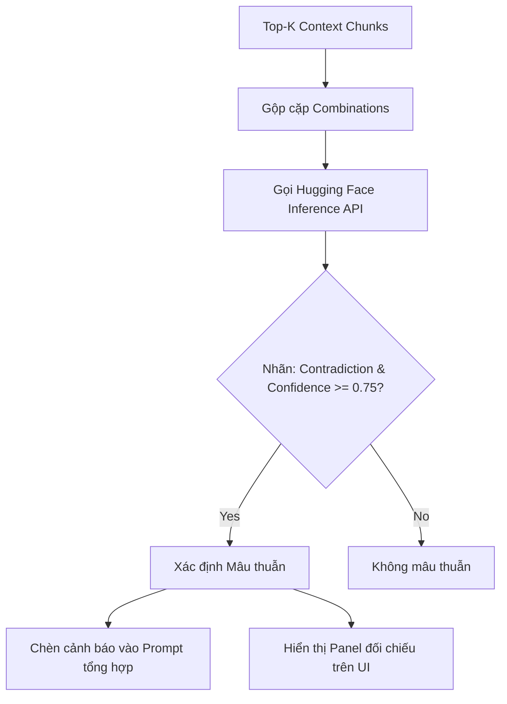

# Báo cáo Hệ thống Kiểm tra Mâu Thuẫn Nguồn (RoBERTa-large-MNLI)

Báo cáo này tài liệu hóa thiết kế, cơ chế hoạt động và kết quả áp dụng hệ thống **kiểm tra mâu thuẫn nguồn (Contradiction/Conflict Detection)** phục vụ tính năng chống bịa đặt (anti-hallucination) trong ứng dụng RAG Agent.

---

## 1. Bối cảnh bài toán

Trong các hệ thống RAG (Retrieval-Augmented Generation), khi người dùng đặt câu hỏi phức tạp hoặc cần tổng hợp thông tin từ nhiều nguồn tài liệu khác nhau, hệ thống RAG sẽ truy hồi ra danh sách các đoạn ngữ cảnh liên quan nhất (Top-K Context Chunks). Tập ngữ cảnh này thường được tổng hợp trực tiếp và truyền vào mô hình ngôn ngữ lớn (LLM) để sinh câu trả lời cuối cùng kèm trích dẫn nguồn.

---

## 2. Vấn đề đặt ra

Khi tài liệu nguồn được biên soạn bởi nhiều tác giả, cập nhật ở nhiều thời điểm khác nhau, hoặc chứa các thông tin mang tính đối lập trực tiếp (ví dụ: hạn mức ngân sách dự án khác nhau giữa bản cũ và mới, ngày hiệu lực điều khoản trái ngược, hoặc công thức toán học đối nghịch):
* LLM tổng hợp (Synthesizer) có xu hướng trộn lẫn các dữ liệu mâu thuẫn này thành một câu trả lời thiếu chính xác, hoặc tự chọn một bên để hiển thị mà không hề cảnh báo cho người dùng biết có sự bất nhất.
* Hệ thống RAG thông thường thiếu cơ chế tự động đối chiếu chéo (cross-check) thông tin giữa các đoạn nguồn trước khi trả lời.

Do đó, vấn đề đặt ra là cần xây dựng một bộ phát hiện mâu thuẫn thông tin (Pairwise Contradiction Detection) ở cấp độ đoạn nguồn một cách tự động, chính xác và trực quan.

---

## 3. Phương pháp sử dụng để giải quyết

Hệ thống triển khai mô hình học máy chuyên biệt cho tác vụ NLI để phân loại quan hệ mâu thuẫn của các quan điểm giữa các đoạn ngữ cảnh.

### 3.1 Mô hình NLI (Natural Language Inference)
* **Mô hình:** Sử dụng mô hình `FacebookAI/roberta-large-mnli` (chạy serverless qua Hugging Face Inference API).
* **Đặc tính:** Phân loại quan hệ giữa cặp câu (**Tiền đề - Premise** và **Giả thuyết - Hypothesis**) thành 3 nhãn:
  * **Entailment (Kéo theo/Đồng thuận):** Câu Giả thuyết được suy ra từ câu Tiền đề (đồng nhất hoặc không mâu thuẫn thông tin).
  * **Neutral (Trung lập):** Không đủ cơ sở thông tin để khẳng định là đồng thuận hay mâu thuẫn.
  * **Contradiction (Mâu thuẫn/Trái ngược):** Câu Giả thuyết phủ định hoặc mâu thuẫn trực tiếp với câu Tiền đề.

### 3.2 Quy trình thực thi chi tiết

* **Biểu đồ luồng kiểm tra mâu thuẫn:**

* **Các bước triển khai chi tiết:**
  * **Bước 1: Tạo cặp so sánh:** Kết hợp chéo các đoạn thông tin truy hồi được thành từng cặp đôi một để chuẩn bị đối chiếu chéo, có giới hạn số lượng cặp tối đa để đảm bảo hiệu năng phản hồi của hệ thống.
  * **Bước 2: Phân tích mâu thuẫn qua mô hình NLI:** Đưa từng cặp thông tin đã ghép vào mô hình học máy để phân loại mối quan hệ ngữ nghĩa. Hệ thống tích hợp cơ chế tự động thu gọn độ dài văn bản nếu dung lượng vượt quá giới hạn xử lý của mô hình.
  * **Bước 3: Nhận diện mâu thuẫn:** Lọc ra các cặp thông tin có độ tin cậy cao được mô hình phân loại là đối nghịch nhau để đánh dấu là mâu thuẫn nguồn.
  * **Bước 4: Cảnh báo vào ngữ cảnh:** Chèn thông tin cảnh báo về các nguồn mâu thuẫn vào ngữ cảnh hội thoại của mô hình ngôn ngữ lớn (LLM). Việc này định hướng cho LLM trả lời một cách khách quan, chỉ rõ các quan điểm đối lập thay vì tự ý trộn thông tin.
  * **Bước 5: Lọc hiển thị trên giao diện:** Sau khi LLM sinh câu trả lời, hệ thống đối chiếu và chỉ hiển thị cảnh báo mâu thuẫn trên giao diện đối với những tài liệu thực sự được trích dẫn trong câu trả lời, giúp giao diện gọn gàng và tránh gây phân tâm cho người dùng.

---

## 4. Kết quả thực nghiệm & Bộ chỉ số đánh giá A/B Testing

Để đánh giá một cách toàn diện hiệu quả của module kiểm tra mâu thuẫn nguồn (Conflict Checking) trong DRAG so với hệ thống Baseline RAG truyền thống, chúng tôi thiết lập bộ chỉ số A/B Testing và tiến hành kiểm thử thực tế trên tập dữ liệu **20 câu hỏi** có tỷ lệ phân bố cân bằng (**50% có xung đột thực tế và 50% không xung đột**):
*   **10 câu không xung đột** (`DC001` - `DC010`): Các câu hỏi tra cứu thông tin thông thường.
*   **10 câu có xung đột** (`DC014`, `DC015`, `DC020`, `DC021`, `DC022`, `DC037`, `DC063`, `DC070`, `DC088`, `DC089`): Chứa mâu thuẫn về mốc hiệu lực thời gian, số liệu cập nhật không thống nhất, hoặc các giả thuyết có tiền đề sai lệch.

### 4.1 Bảng so sánh chỉ số đánh giá tổng hợp

| Chỉ số | Baseline (RAG thường) | DRAG RAG | Chênh lệch (Delta) | Ý nghĩa chỉ số |
| :--- | :---: | :---: | :---: | :--- |
| **Answer Correctness** | `0.440` | `0.630` | **+0.190 (+43.2%)** | Đo lường độ chính xác về mặt nội dung của câu trả lời so với Ground Truth |
| **Answer Relevancy** | `0.675` | `0.905` | **+0.230 (+34.1%)** | Mức độ tập trung và tránh lan man, đi thẳng vào trọng tâm câu hỏi |
| **Faithfulness** | `0.480` | `0.630` | **+0.150 (+31.3%)** | Độ chân thực và trung thực so với ngữ cảnh (chống ảo giác thông tin) |
| **Behavior Alignment** | `0.475` | `0.675` | **+0.200 (+42.1%)** | Đo lường mức độ tuân thủ chính sách xử lý xung đột của hệ thống |
| **Conflict Accuracy** | `-` | `55.0%` (11/20) | `-` | Độ chính xác của module phân loại mâu thuẫn |
| **Confidence Score** | `-` | `0.905` | `-` | Độ tin cậy trung bình của mô hình LLM Judge khi đánh giá mâu thuẫn |
| **Average Latency** | `3.69s` | `8.16s` | `+4.47s` | Thời gian phản hồi trung bình cho mỗi truy vấn |
| **Average Tokens** | `2123.3` | `4453.4` | `+2330.1 (+109.7%)` | Số lượng API token tiêu thụ trung bình cho mỗi truy vấn |

### 4.2 Nhận xét ngắn gọn
* **Hiệu năng phân loại:** Module phân loại mâu thuẫn đạt Accuracy chung là **55.0%** (trong đó phát hiện được toàn bộ 10/10 câu hỏi có xung đột thực tế nhưng báo động nhầm 9 câu không xung đột) với độ tin cậy LLM Judge trung bình đạt **90.5%**.
* **Chất lượng câu trả lời & Độ chân thực:** DRAG RAG giúp cải thiện vượt bậc mọi khía cạnh chất lượng khi đối mặt với xung đột: **Answer Correctness tăng +0.190** (lên `0.630`), **Answer Relevancy tăng +0.230** (lên `0.905`), **Faithfulness tăng +0.150** (lên `0.630`), và quan trọng nhất là **Behavior Alignment tăng +0.200** (lên `0.675`). Điều này chứng tỏ LLM đã tuân thủ tốt chính sách xử lý xung đột, hạn chế ảo giác và phản hồi trung lập.
* **Đánh đổi tài nguyên (Latency & Tokens):** Chi phí để có được câu trả lời chất lượng cao và chống ảo giác là độ trễ trung bình tăng thêm **+4.47s** (từ `3.69s` lên `8.16s`) và số token tiêu thụ trung bình tăng **~2.1 lần** (`4453.4` so với `2123.3` tokens).

---

## 5. Hướng phát triển để đưa vào Production

Để tối ưu hóa hệ thống kiểm tra mâu thuẫn nguồn đạt tiêu chuẩn vận hành thực tế (giảm latency xuống dưới 2s và nâng cao độ chính xác), chúng tôi đề xuất các hướng phát triển cụ thể sau:

1.  **Áp dụng Mô hình NLI Đa ngôn ngữ (Multilingual NLI):**
    *   Chuyển sang sử dụng các mô hình hỗ trợ trực tiếp tiếng Việt như `MoritzLaurer/mDeBERTa-v3-base-xnli-multilingual` or `symanto/xlm-roberta-base-snli-mnli`.
    *   *Hiệu quả:* Loại bỏ hoàn toàn bước dịch thuật trung gian bằng LLM, giúp giảm thời gian xử lý xuống tối thiểu **50%** và giữ nguyên vẹn sắc thái ngữ nghĩa gốc của tiếng Việt (cải thiện đáng kể Recall và Precision).
2.  **Self-hosting mô hình NLI cục bộ (Local Deployment):**
    *   Triển khai mô hình NLI (dung lượng nhỏ gọn khoảng 1GB đến 1.5GB như mDeBERTa-v3-base) trực tiếp trên máy chủ GPU/CPU cục bộ bằng Triton Inference Server, vLLM hoặc FastAPI + ONNX Runtime.
    *   *Hiệu quả:* Loại bỏ hoàn toàn độ trễ mạng và giới hạn rate limit của Hugging Face Inference API, giảm thời gian suy luận (inference) cho 45 cặp so sánh xuống mức **mili-giây** (ước tính dưới `0.5s`).
3.  **Song song hóa và Batching (Async NLI Requests):**
    *   Cải tiến mã nguồn để gọi mô hình NLI theo dạng batch bất đồng bộ (Asynchronous batching) thay vì chạy tuần tự.
    *   *Hiệu quả:* Tận dụng tối đa khả năng tính toán song song của phần cứng (GPU/Inference Endpoint), giảm thiểu thời gian chờ đợi tuyến tính.
4.  **Cơ chế Caching bản dịch và kết quả NLI:**
    *   Lưu trữ cache kết quả NLI cho các cặp đoạn văn bản cố định trong cơ sở dữ liệu.
    *   *Hiệu quả:* Tránh phải tính toán lại đối với các truy vấn lặp lại hoặc các ngữ cảnh trùng lặp được truy hồi nhiều lần trong một phiên làm việc (session).
